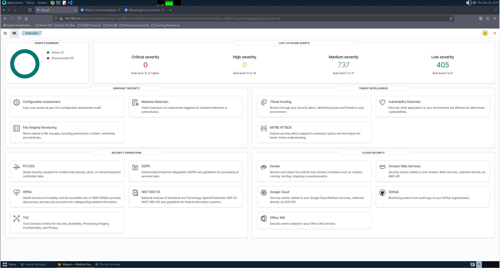
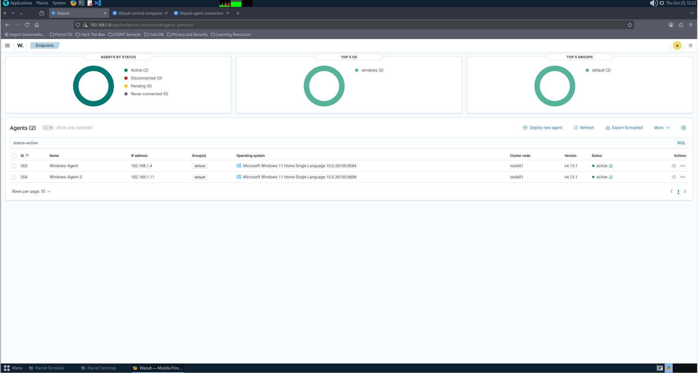

# SIEM Lab using Wazuh (Docker-Based Home Network Setup)

## Overview
This project demonstrates a Security Information and Event Management (SIEM) setup using Wazuh, deployed via Docker on a Linux machine. The lab monitors multiple endpoints within a home network and provides real-time visibility into system activity, file integrity, and security events.

---

### Architecture
- Wazuh Manager deployed using Docker (Linux host)
- 2 Windows endpoints configured as agents
- All systems connected within the same subnet
- Logs collected, analyzed, and visualized via Wazuh Dashboard

---

### Key Features
- File Integrity Monitoring (FIM) to detect unauthorized changes  
- Custom rule creation for activity tracking  
- Endpoint behavior monitoring (including browsing activity logs)  
- Automated compliance and configuration checks  
- Real-time alerting with severity classification  

---

## Deployment (Docker Setup)

### Step 1: Install Docker
```bash
sudo apt update
sudo apt install docker.io docker-compose -y
```

### Step 2: Clone Wazuh Docker Repository
```bash
git clone https://github.com/wazuh/wazuh-docker.git
cd wazuh-docker
```

### Step 3: Start Wazuh Stack
```bash
docker-compose up -d
```

## This deploys:

* Wazuh Manager
* Elasticsearch
* Wazuh Dashboard

## Agent Configuration (Windows Endpoints)

### Step 1: Install Agent

Download and install Wazuh agent on Windows systems.

### Step 2: Configure Agent

### Update configuration:
```bash
<address>WAZUH_MANAGER_IP</address>
```
### Step 3: Start Agent

* Start the agent service
* Verify connection in dashboard

## Network Configuration
* All endpoints connected within same subnet
* Manager IP used for communication
* Required ports opened for agent-manager communication
  
## Use Cases Implemented
### 1. File Integrity Monitoring (FIM)

### Monitors critical files and directories for:

* File modification
* File deletion
* Unauthorized access

### Example: Modifying a system file triggered an immediate alert.

### 2. Endpoint Activity Monitoring

### Custom rules were created to:

* Track system-level activity
* Analyze endpoint behavior patterns
* Monitor browsing-related logs

### 3. Compliance & Security Checks
* Evaluates system configurations
* Identifies weak or insecure settings
* Helps understand baseline security posture

## Testing & Validation
### Test 1: File Modification
* Modified a monitored file
* Alert generated instantly
  
### Test 2: Normal Activity Simulation
* Browsing + system usage
* Logs collected and categorized correctly
## Sample Alert
```bash
{
  "rule": "File modified",
  "location": "/etc/passwd",
  "severity": "high"
}
```
## 📸 Screenshots

<p align="center">
  
</p>

<p align="center">
  
</p>

## 🔗 Project Origin

<p>
  This project was originally shared on LinkedIn:<br>
  <a href="https://www.linkedin.com/feed/update/urn:li:activity:7387052171105693696/" target="_blank">
    View the full post
  </a>
</p>
